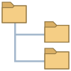

# Folder Tree Creator

🔗 [Download](https://github.com/Special-Niewbie/FolderTreeCreator) 

I created this small tool — not sure how useful it will be to others, but I personally found myself needing something simple to generate multiple folders and subfolders quickly.

Instead of manually creating nested directories one by one for organizing my photos and documents, I made this lightweight and portable utility. It even supports adding placeholder files within folders, making it suitable for organizing:

- Projects and documents
- Photos, memories, archives
- Predefined program folder structures
- Embedded system file layout planning
- ... and more! Let your imagination decide.

### ✨ Features

- Create complex folder hierarchies with a visual tree
- Add placeholder files (.txt or without extension)
- Automatically renames duplicate files to avoid overwriting
- Portable (no installation required)
- Lightweight and easy to use
- Tray icon with menu and version info

### How to Use

1. Launch the tool.
2. Select the destination folder.
3. Use the `+ Add` and `+ Add File` buttons to build your structure.
4. Press `Start` to generate the folder tree and files.

### 💡 Example Use Cases

- Organizing photography sessions
- Preparing structured codebases
- Planning file systems for embedded devices
- Creating templates for repeated directory structures

---

Enjoy and feel free to let me know how to improve it! 
No setup needed — just run and go!